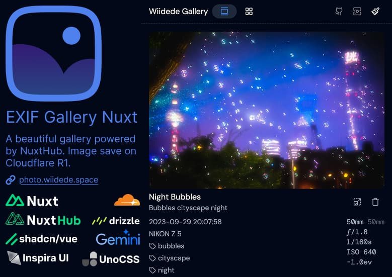

# EXIF Gallery Nuxt

[English](README.md) | [简体中文](README_zh.md)

A full-stack photo album solution that integrates AI intelligent processing, browser image compression, and other functions.



[](https://admin.hub.nuxt.com/new)

## Features

- 📷 Image upload and display with [`hubBlob()`](http://hub.nuxt.com/docs/storage/blob)
- 🌐 Cloud Storage: Blob powered by NuxtHub (cloudflare R2)
- 🤖 AI Integration: Support for OpenAI and Gemini for intelligent image processing
- 🗜️ Image Compression: Multiple format support (JPEG, WebP, AVIF) with JSQuash
- 🎨 Modern UI: Beautiful components with shadcn-vue and inspira-ui
- 🏃🏻 [View transition API](https://developer.chrome.com/docs/web-platform/view-transitions) The View Transitions API provides a mechanism for easily creating animated transitions between different DOM states while also updating the DOM contents in a single step
- 🔑 [Nuxt Auth Utils](https://github.com/Atinux/nuxt-auth-utils) Minimalist Authentication module for Nuxt exposing Vue composables and server utils

## Stack

- [NuxtHub](https://hub.nuxt.com) - A Nuxt toolkit to build fullstack applications on the edge
- [UnoCSS](https://unocss.dev/) - The instant on-demand atomic CSS engine
- [shadcn-vue](https://www.shadcn-vue.com/) - Beautifully designed components built with Reka UI and Tailwind CSS
- [inspira-ui](https://inspira-ui.com/) - Collection of beautiful UI components to build stunning animated interfaces
- [VueUse](https://github.com/antfu/vueuse) - Collection of useful composition APIs
- [ESLint](https://eslint.org/) with [@nuxt/eslint-config](https://github.com/nuxt/eslint), single quotes, no semi
- [TypeScript](https://www.typescriptlang.org/)

## Setup

1. Clone this repository to your local machine.
2. Install dependencies using the command `pnpm install` or your favorite package manager.
3. Run the application with the command `pnpm dev` or your favorite package manager.

> If you don't have pnpm installed, run: `corepack enable pnpm`

## Environment Variables

- `NUXT_ADMIN_PASSWORD` - A password to access the admin panel and upload images, will default to `admin` if not provided.
- `NUXT_SESSION_PASSWORD` - A secret key for session encryption used by [nuxt-auth-utils](https://github.com/Atinux/nuxt-auth-utils), will be generated automatically if not provided in development mode.
- `NUXT_PUBLIC_TITLE` - The title of the application, will default to `Exif Gallery Nuxt` if not provided.
- `NUXT_PUBLIC_DESCRIPTION` - The description of the application, will default to `A full-stack photo album solution that integrates AI intelligent processing, browser image compression, and other functions` if not provided.

## Development

```bash
pnpm dev
```

### Remote Storage

Once you deployed your project, you can connect to your remote database locally running:

```bash
pnpm dev --remote
```

### Deploy

You can deploy this project on your Cloudflare account for free using [NuxtHub](https://hub.nuxt.com).

```bash
npx nuxthub deploy
```

It's also possible to leverage Cloudflare Pages CI for deploying, learn more about the different options on <https://hub.nuxt.com/docs/getting-started/deploy>

Learn more about remote storage on <https://hub.nuxt.com/docs/getting-started/remote-storage>

## Contribution

Contributions are welcome! Feel free to open an issue to report a bug or submit a feature request via a pull request.

## Credits

Thanks to [exif-photo-blog](https://github.com/sambecker/exif-photo-blog)
Thanks to [nuxt-image-gallery](https://github.com/Flosciante/nuxt-image-gallery)
